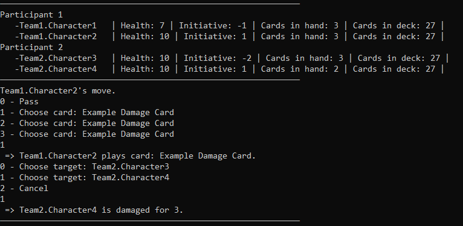
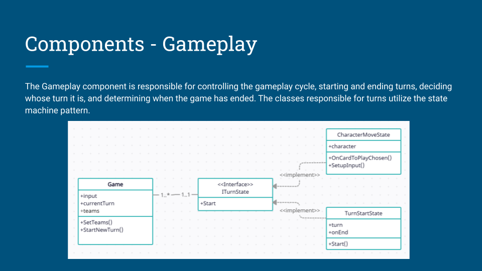
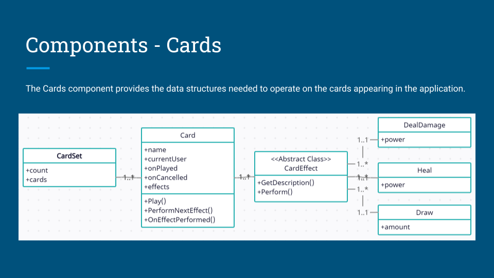

# About project
Console application that represents backend of a made-up card game with rules loosely inspired by Slay the Spire and Darkest Dungeon.

The goal of the project was to implement playing against enemy AI that uses Tree-Search and GOAP (Goal Oriented Action Planning) algorithms to find the best moves.

### Notable classes:
* [TreeSearchAi](Ngin/GameParticipants/AI/TreeSearchAi.cs)
* [Heuristics](Ngin/GameParticipants/AI/Heuristics.cs)
* [Character](Ngin/Characters/Character.cs)

# Improvement possibilities
The application is a proof-of-concept and satisfies the goal of learning more about enemy AI in turn-based and/or card games. However, to make it more 
interesting and to really test the possibilities and limits of the implemented enemy AI, more different cards and card effects could be added.

# Architecture
Project architecture is presented on the following images.
### Components

### Program Loop

